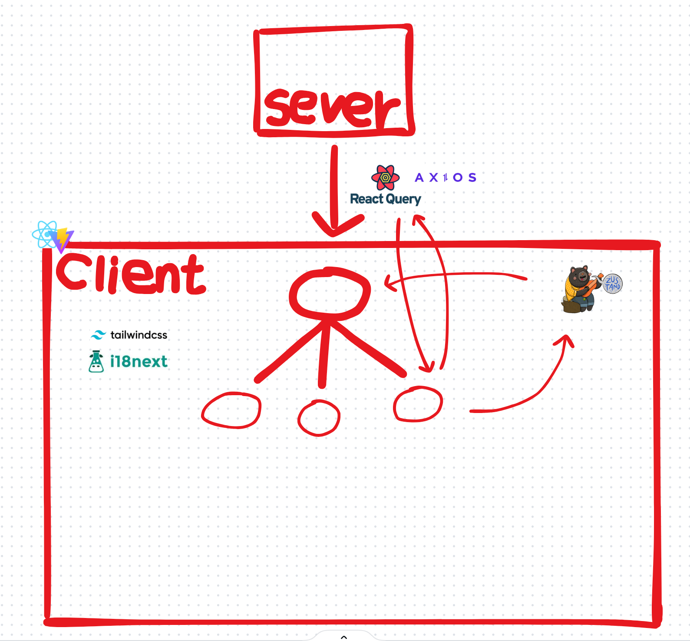

# Lineus-Frontend Documentation

## Overview

Lineus-Frontend is a modern web application for chat and group management, built with React, Vite, and Tailwind CSS. It supports individual and group messaging, group projects, and user authentication, with a modular and scalable architecture.

---

## Architecture



### Main Technologies
- **React** (with hooks and context)
- **Vite** (fast development/build)
- **Tailwind CSS** (utility-first styling)
- **Headless UI** (accessible UI components)
- **Zustand** (state management)
- **React Query** (data fetching/caching)
- **Docker** (containerization)

---

## Project Structure

```
src/
  components/      # Reusable UI components (buttons, icons, modals, loaders, etc.)
  hooks/           # Custom React hooks (chat, group, user, etc.)
  services/        # API and business logic (chat, user, group, etc.)
  context/         # React context providers (modal, notification)
  store/           # Zustand stores for state management
  utils/           # Utility functions (date, encoding, errors, etc.)
  config/          # App configuration and constants
  i18n/            # Internationalization (i18n) setup and translations
  layout/          # Layout components for different user roles
  router/          # Routing configuration
  view/            # Page-level components (auth, dashboard, etc.)
  assets/          # Static assets (images, SVGs)
  api/             # API service abstraction
  validations/     # Validation schemas (zod)
public/
  assets/          # Public images and branding for different clients
  images/          # Additional public images
conf/
  conf.d/          # Nginx configuration for Docker deployment
Dockerfile         # Docker build instructions
docker-compose.yaml# Docker Compose setup
vite.config.js     # Vite configuration
tailwind.config.js # Tailwind CSS configuration
package.json       # Project dependencies and scripts
```

---

## Main Features

- **Authentication**: Login via standard or LTI (Learning Tools Interoperability)
- **Chat**: Individual and group chat, with real-time updates via WebSocket
- **Group Management**: Create, join, and manage groups and group projects
- **Dashboard**: User dashboard with chat, group, and project overviews
- **Internationalization**: Multi-language support (KR, EN, CH)
- **Responsive UI**: Modern, accessible, and mobile-friendly design

---

## Key Folders and Files

- `src/components/`: UI elements (buttons, icons, modals, loaders, sidebars, etc.)
- `src/hooks/`: Custom hooks for chat, group, user, and more
- `src/services/`: API logic for chat, user, group, and project management
- `src/context/`: Context providers for modal and notification state
- `src/store/`: Zustand stores for global state (user, chat, group, etc.)
- `src/utils/`: Utility functions (date, encoding, error handling)
- `src/config/`: App-wide configuration and constants
- `src/i18n/`: Internationalization setup and translation files
- `src/layout/`: Layouts for admin, professor, student, and protected routes
- `src/router/`: Routing logic and route configuration
- `src/view/`: Page-level components (auth, dashboard, chat, etc.)
- `conf/`: Nginx configuration for Docker deployment
- `Dockerfile`, `docker-compose.yaml`: Containerization and deployment

---

## Setup & Run Instructions

### Local Development
1. Install dependencies:
   ```sh
   npm install
   ```
2. Copy `.env.sample` to `.env.development` and configure as needed.
3. Start the development server:
   ```sh
   npm run dev
   ```

### Docker Deployment
1. Build and run with Docker Compose:
   ```sh
   docker-compose up --build
   ```
2. The app will be available at [http://localhost:8081](http://localhost:8081)

---

## Additional Notes

- **Storybook**: Run `npm run storybook` to view UI components in isolation.
- **Linting/Formatting**: Use `npm run lint` and Prettier for code quality.
- **Production Build**: `npm run build` creates an optimized build in the `dist/` folder.

---

## License

This project is proprietary and not open source.


